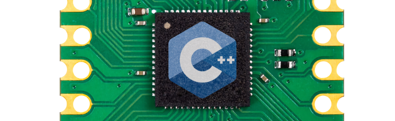

# Pi Pico C++
*C++ prototyping tools for pi pico*



Make complex C++ projects for the pi pico without all the boilerplate. Jump right into talking to hardware and reacting to user input, without reading a tons of docs or writing tons of code.

> This repo is a work in progress. Some components are still being generalized. Each header requires different pieces of the pico SDK. This will eventually be automated.

# Getting Started
This process should work the same in macOS, Windows, and Linux

1. Install [Visual Studio Code](https://code.visualstudio.com/Download) and [Docker](https://www.docker.com/products/docker-desktop/)
2. Clone the [pico-sdk](https://github.com/raspberrypi/pico-sdk)
3. Next to this on disk, clone the [sample project repo](https://github.com/DonkeyKong/ppc-sample-project) (or your own fork of it)
4. Open Folder... `ppc-sample-project` in vscode
    - When prompted, click `Reopen In Container`
    - Choose the `GCC 8.3.1 arm-none-eabi` toolchain when prompted
5. Click Build

The project should build and you can deploy the .uf2 file to a pico if you want. From here, just start building on top of the sample project.

# Modules
## Debug Logging
```c++
#include <cpp/Logging.hpp>
#define LOGGING_ENABLED

DEBUG_LOG("Plain message");
DEBUG_LOG("Message will time out in " << timeoutMs << " ms");
DEBUG_LOG_IF((returnCode != 0), "Something went wrong!");
```

If you don't define `LOGGING_ENABLED`, logging is bypassed without any performance or size penalty. The strings aren't even compiled into your app.

### About Standard Out on pico
If you're new to the pico and you're wondering where these logs print: you choose UART or USB in your cmake file. 

```cmake
pico_enable_stdio_usb(${PROJECT_NAME} 1)  # swap for uart
pico_enable_stdio_uart(${PROJECT_NAME} 0)
```

You'll also need to init stdio at the top of your main function.

```c++
int main()
{
  // Configure stdio
  stdio_init_all();

  // If debug logging is on, wait so USB terminals can
  // reconnect and catch any startup messages.
  #ifdef LOGGING_ENABLED
  sleep_ms(2000);
  #endif
  
  // ...
}
```

I like USB, as it presents the pico as a USB serial adapter to your PC. Use any terminal emulator to connect to the serial device.

## Command Parser
This module lets you use stdin as a simple command processor.

```c++
#include <cpp/CommandParser.hpp>

CommandParser parser;
parser.addCommand("release", [&]()
{
  servoX.release();
  servoY.release();
}, "", "Power down all servos");

// Main loop
while(true)
{
  parser.processStdIo();
}
```

Commands can take arguments, so long as all the argument types can be assigned using `operator>>` from an istream. You can also return true or false to indicate if your command ran ok.

```c++
parser.addCommand("mt", [&](double x, double y)
{
  if (between(x, 0.0, 1.0) && between(y, 0.0, 1.0))
  {
    servoX.posT(x);
    servoY.posT(y);
    return true; // returning true prints "ok"
  }
  return false; // returning false prints "err"
}, "[x] [y]", "Move to (x, y)");
```

This command is invoked from a connected terminal like this:
>mt 0.43 1.0

Typing `help` lists all commands.

```
help

Command Listing:

    release              Power down all servos
    mt [x] [y]           Move to (x, y)
```

This is not a full terminal emulator but it contains just enough features to act as a debug/programming interface and get a project going.

## Flash Storage
Saving settings or other data to flash memory on the pi pico is harder than it should be. This module lets you take a C++ data structure, then read or write it to flash, as a way of saving settings.

```c++
#include <cpp/FlashStorage.hpp>

struct Settings
{
  float center = 0.0f;
  bool autoShutoff = true;
};

FlashStorage<Settings> flashStorage;
flashStorage.readFromFlash();
flashStorage.data.autoShutoff = false;
flashStorage.writeToFlash();
```

See the `FlashStorage.hpp` header for more technical details.

> ⚠️ Frequent writes to flash memory may reduce the lifespan of the pi pico. Write to flash memory infrequently (i.e.: a few times per day, not 100 times per second)

## Button
```c++
#include <cpp/Logging.hpp>
#include <cpp/Button.hpp>

// Button connects pin 2 to ground when pressed
// Press and hold detection enabled
GPIOButton button(2, true);

// main loop
while (1)
{
  button.update();
  DEBUG_LOG_IF(button.buttonDown(), "button pressed");
  DEBUG_LOG_IF(button.buttonUp(), "button released");
  DEBUG_LOG_IF(button.heldActivate(), "button held (repeating)");
}
```

> GPIO is only one type of Button. Anything with a fetchable boolean state can be a "Button". Make your own classes that inherit from Button.

## DiscreteOut.hpp
```c++
#include <cpp/DiscreteOut.hpp>

// Pin 1, pulls down by default
DiscreteOut out1(1);
out1.set(true);
```
> This is a light wrap of pico C API and mostly useful to skip looking up documentation.

## Nintendo Peripherals
### Nunchuck
Wire a Wii Nunchuck to one of the i2c busses and go!

```c++
#include <cpp/Logging.hpp>
#include <cpp/Nunchuck.hpp>

Nunchuck nunchuck(i2c1, 14, 15); // device, data, clock

// Main loop
while (true)
{
  nunchuck.requestControllerState();
  // Nunchuck will take ~5ms to be ready for fetch
  // so do stuff here if you want. Fetch will block
  // if it needs to.
  if (nunchuck.fetchControllerState())
  {
    if (nunchuck.c())
    {
      DEBUG_LOG("C button pressed");
    }
  }
}

> 💡 The C and Z buttons are actually the `Button` class from this library, so they have all those features.
```

### N64 Controller (Input)
(TBI) Reads the state of an N64 controller, detecting button presses and stick movement.

### N64 Controller (Output)
(TBI) Emulates an N64 controller and sends input to a real N64.

### Joybus Host and Client
(TBI) N64 controller support is built on top of a custom PIO implementation of the Joybus protocol. You can also use these joybus host and client classes to talk to other retro Nintendo hardware like gameboys (via link cable), or the gamecube.

## Addressable LEDs (NeoPixel)
Control a Ws2812b, NeoPixel, or other compatible chain of individually addressable LEDs.

```c++
#include <cpp/LedStripWs2812b.hpp>

LEDBuffer buffer {{255,0,0}, {0,255,0}, {0,0,255}}; // RGB
LedStripWs2812b leds = LedStripWs2812b::create(0); // GPIO 0
leds.writeColors(buffer);
```

> 💡 Brightness, color balance, and gamma correction are all supported to ensure uniform light output with the same LEDBuffer across different makes and models of LEDs. Check out the methods of LedStripWs2812b.

## Motors and Motion
### MotorKit
Support for the [adafruit Motorkit Hat](https://www.adafruit.com/product/2348). Communicates with motor controller via i2c to drive steppers or DC motors.

```c++
#include <cpp/MotorKit.hpp>

// Use i2c interface 0 on GPIO pins 0 and 1
MotorKit motorKit(i2c0, 0, 1);

// Connect a NEMA-17 stepper with:
//    200 steps per rev
//    8 microsteps
//    230 rpm max speed
//    reversed = true (motorkit seems to be nominally backwards)
Stepper& stepper = *motors.connectStepper(0, {200, 8, 230, true});

// Move 1 revolution in microsteps. Moves are always specified in usteps
// for consistency, even when single or double stepping
stepper.move(1600)

// Move in degrees
stepper.moveDegrees(360.0f)
```

### Motion Stage
Create, home, and move a 2D stepper motor driven stage. Implementations available for direct drive and core XY stype stages.

```c++
#include <cpp/Button.hpp>
#include <cpp/MotionXY.hpp>

// Get stepper objects, perhaps from MotorKit
Stepper& stepperA = getStepper(...);
Stepper& stepperB = getStepper(...);

// Connect some limit switches
GPIOButton limSwitchX(0);
GPIOButton limSwitchY(1);

// Our steppers are 200 steps per revolution and GT2 pulleys
// have 20 teeth spaced 2 mm apart: 200 / (20 * 2) = 5
double stepsPerMm = 5.0;

// Create a core XY stage and provide it all the hardware refs and information it needs.
StageCoreXY stage(
  stepperA, stepperB,       // Stepper motors to use for A and B belts
  limSwitchX, limitSwitchY, // Limit switches for the X and Y axes
  200.0, 200.0,             // Size of the X and Y axes in mm
  5.0, 5.0,                 // Distance in mm from limit switches to 0,0
  25.0,                     // Homing speed in mm/sec
  stepsPerMm, stepsPerMm    // steps/mm of A,B belt movement
);

stage.home();

// Move stage in a 100mm square at 60 mm/sec
stage.moveTo(100.0, 0.0, 60.0);
stage.moveTo(100.0, 100.0, 60.0);
stage.moveTo(0.0, 100.0, 60.0);
stage.moveTo(0.0, 0.0, 60.0);
stage.completeAllMoves();
```
> ⚠️ Take care with your fingers

### Servo
Provides an interface for servos connected directly to a GPIO pin.

```c++
#include <cpp/Servo.hpp>

// GPIO 0, motion range from -90º to 90º
Servo servo(0, -90.0f, 90.0f);

servo.posT(0.5); // Set normalized position, 0-1
servo.posDeg(45.0); // Set position in degrees
```

> ⚠️ This class is hard coded to update the servo at 60 Hz, as this seems to be a generally accepted safe value for most servos and suitable for most applications.

### Pico PWM Slicing
The pico has 16 PWM outputs, they are aliased across its GPIO pins, and this is *not explained well in the docs*.

| Slice |  Out A  |  Out B  |  Out A* |  Out B* |
|-------|---------|---------|---------|---------|
|     0 | GPIO 0  | GPIO 1  | GPIO 16 | GPIO 17 |
|     1 | GPIO 2  | GPIO 3  | GPIO 18 | GPIO 19 |
|     2 | GPIO 4  | GPIO 5  | GPIO 20 | GPIO 21 |
|     3 | GPIO 6  | GPIO 7  | GPIO 22 | GPIO 23 |
|     4 | GPIO 8  | GPIO 9  | GPIO 24 | GPIO 25 |
|     5 | GPIO 10 | GPIO 11 | GPIO 26 | GPIO 27 |
|     6 | GPIO 12 | GPIO 13 | GPIO 28 | GPIO 29 |
|     7 | GPIO 14 | GPIO 15 |   N/A   |   N/A   |

Outputs on the same slice share the same clock divider and wrap (so they have the same frequency). Since all servos update at 60Hz this does not matter for them but it affects other PWM usage.

Outputs A/A* and B/B* share the same PWM hardware, so attempting to setup e.g.: GPIO 0 and GPIO 16 for PWM usage at the same time will result in the same output on both pins!

## WiFi
(TBI) Very simple class to bring up the wifi interface and connect it to a specified network. Hard coded to WPA2-PSK security. Needs more work to become useful and general purpose.

## NTPSync.hpp
(TBI) Synchronize the pi pico system clock with an internet time server. Based on pi pico examples.

## PioProgram.hpp
(TBD) Document and generalize

## I2C Interface
(TBD) Document and generalize

## Utility Headers
`Color.hpp` -- RGB and HSV color data structures with conversion and some basic processing functions like blend, gamma, multiply, add, and more

`Math.hpp` -- Basic math utils for clamping, interpolation, crawling values, etc

`Vector.hpp` -- Templated implementations of vector types

